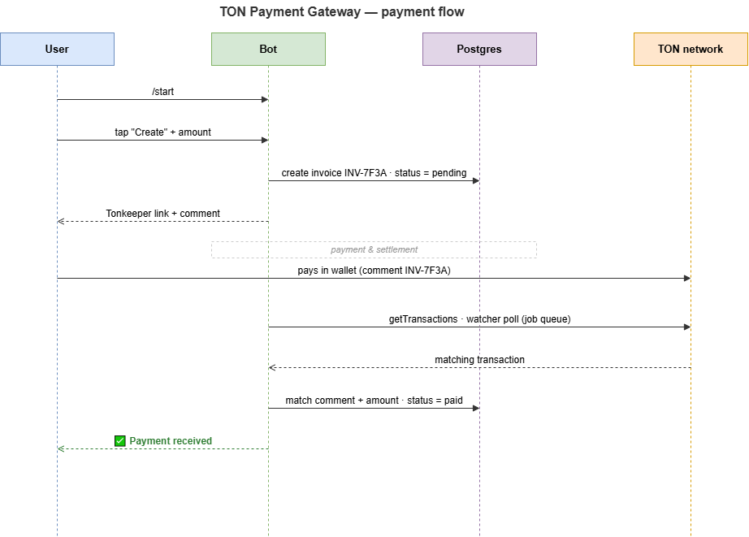

# TON Payment Gateway Bot

A Telegram bot that accepts **TON** payments through invoices. A user requests an
invoice for a given amount, gets a one-tap Tonkeeper payment link with a unique
comment, and the bot automatically confirms the payment by watching the merchant
wallet on-chain.

> Receive-only by design: the gateway never holds private keys or signs
> transactions. It only needs the merchant's **public** wallet address and a
> read-only HTTP API key.

## Features

- 🧾 **Invoice creation** — request any amount in TON via an inline menu.
- 🔗 **Tonkeeper deep links** — payment amount and comment are pre-filled.
- 👁️ **On-chain watcher** — a background job polls the wallet and matches
  incoming transfers to invoices by their unique comment.
- 🔔 **Automatic confirmation** — the buyer is notified the moment a payment lands.
- ⏳ **Invoice lifecycle** — `pending → paid → expired`, with automatic expiry.
- 💰 **Integer money** — amounts are stored as nanotons (`BIGINT`), never floats.

## How it works



A payment is matched when an **incoming** transaction carries a comment equal to
the invoice reference and a value at least equal to the invoice amount. Because
`mark_paid` only updates rows that are still `pending`, a transaction can never be
counted twice.

## Tech stack

- **Python 3.11**, asyncio
- **python-telegram-bot 21** (with `JobQueue` for the watcher)
- **asyncpg** + **PostgreSQL** (fully parameterized queries)
- **aiohttp** against the **toncenter** v2 HTTP API
- **pytest** for the conversion/parsing logic

## Project structure

```
app/
  __init__.py
  __main__.py      # python -m app
  config.py        # settings from environment (.env)
  ton.py           # amount math, payment links, toncenter client
  db.py            # asyncpg repository, parameterized queries
  watcher.py       # background invoice-settlement job
  bot.py           # Telegram handlers + application wiring
  schema.sql       # database schema (nanotons as BIGINT)
tests/
  test_ton.py      # pure-function unit tests
.env.example
requirements.txt
```

## Setup

```bash
# 1. Install dependencies
pip install -r requirements.txt

# 2. Create a Postgres database
createdb ton_gateway

# 3. Configure
cp .env.example .env
#   edit .env: BOT_TOKEN, MERCHANT_WALLET, DATABASE_URL, ...

# 4. Run
python -m app
```

The schema is created automatically on first start.

> **Tip:** try it on testnet first — set `TON_API_BASE_URL=https://testnet.toncenter.com`
> and `TONKEEPER_TRANSFER_URL=https://test.tonkeeper.com/transfer`.

## Configuration

| Variable                 | Required | Default                                | Description                                  |
| ------------------------ | :------: | -------------------------------------- | -------------------------------------------- |
| `BOT_TOKEN`              |    ✅    | —                                      | Telegram bot token from @BotFather           |
| `DATABASE_URL`           |    ✅    | —                                      | Postgres DSN                                 |
| `MERCHANT_WALLET`        |    ✅    | —                                      | Public receiving address                     |
| `TON_API_BASE_URL`       |          | `https://toncenter.com`                | toncenter base URL (testnet variant exists)  |
| `TON_API_KEY`            |          | —                                      | toncenter API key (higher rate limits)       |
| `TONKEEPER_TRANSFER_URL` |          | `https://app.tonkeeper.com/transfer`   | Deep-link base for payment buttons           |
| `INVOICE_TTL_MINUTES`    |          | `30`                                   | How long an invoice stays payable            |
| `POLL_INTERVAL_SECONDS`  |          | `20`                                   | Wallet polling interval                      |
| `MIN_AMOUNT_TON`         |          | `0.01`                                 | Minimum invoice amount                       |
| `MAX_AMOUNT_TON`         |          | `100`                                  | Maximum invoice amount                       |

## Testing

```bash
pip install -r requirements-dev.txt
pytest
```

The unit tests cover the money math, payment-link building, and transaction
parsing — all without a network or database.

## Security notes

- No private keys: the service is **receive-only**.
- Secrets live in `.env` (git-ignored); nothing sensitive is committed.
- All SQL is parameterized via asyncpg — no string interpolation into queries.
- Money is handled as integer nanotons to avoid floating-point drift.

## License

MIT
